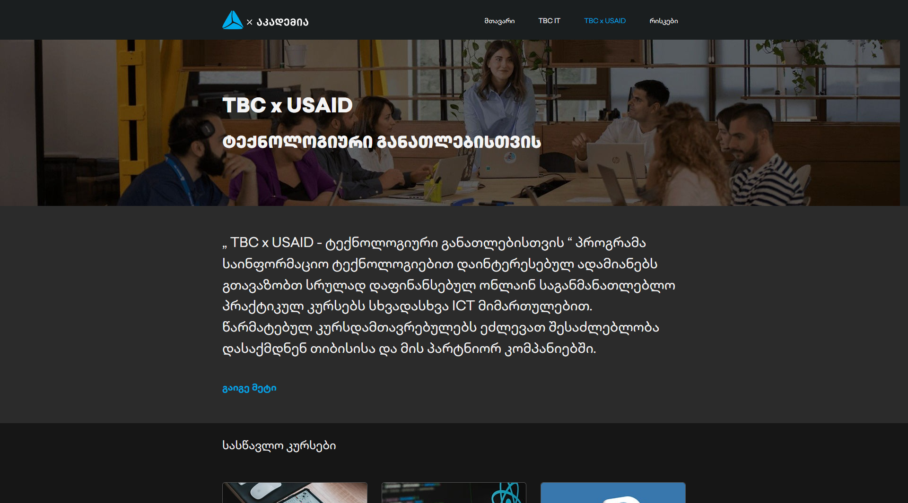

# TBC ტექნიკური დავალება

## სარჩევი

- [პროექტის შესახებ](#პროექტის-შესახებ)
  - [სტრუქტურა](#სტრუქტურა)
  - [გვერდის სქრინი](#გვერდის-სქრინი)
  - [მისამართები](#მისამართები)
- [გამოყენებული ტექნოლიგიები](#გამოყენებული-ტექნოლოგიები)
- [პროექტის გაშვების ინსტრუქცია](#ინსტრუქცია)
- [ავტორი](#ავტორი)

## პროექტის-შესახებ

### სტრუქტურა

პროექტი შედგება 7 სექციისგან:
    1. ნავიგაცია(navbar)
    2. სათავო სექცია(Welcome section)
    3. ინფორმაციის სექცია(Information section)
    4. კურსების სექცია(Courses grid section)
    5. პარტნიორების სექცია(Partners slider section)
    6. ხშირად დასმული კითხვების სექცია(Q&A section)
    7. ქვედა სექცია(Footer section)

### გვერდის-სქრინი

### გვერდის მისამართები

- რეპოზიტორია: [Github Repository](https://github.com/Luka-khokhashvili/TBCxUSAID.git)
- Live გვერდი: [Github live page](https://luka-khokhashvili.github.io/TBCxUSAID/)

## გამოყენებული-ტექნოლოგიები

- სემანტიკური HTML5
- CSS transitions
- Flexbox
- CSS Grid
- Mobile რესპონსიული დიზაინი
- Pure JavaScript ფუნქციები
- Git
- GitHub pages(Live გვერდის უზრუნველსაყოფად)

## ინსტრუქცია

პროექტის გასაშვებად შესაძლებელია გამოყენებულ იქნეს live გვერდის [მისამართი](https://luka-khokhashvili.github.io/TBCxUSAID/)

ასევე პროექტის გაშვება შესაძლებელია GitHub -ის რეპოზიტორიაში აღწერის ქვემოთ მითითებულ მისამართზე დაკლიკების საფუძველზე

პროექტის ფაილების და კოდის სანახავად გადადით GitHub [რეპოზიტორიაში](https://github.com/Luka-khokhashvili/TBCxUSAID.git), სადაც ნახავთ ყველა გამოყენებულ რესურსს და ფაილს.

## ავტორი

ლუკა ხოხაშვილი

- Github - [Luka-khokhashvili](https://github.com/Luka-khokhashvili)
- Gmail - [khokhashvililuka](khokhashvililuka@gmail.com)
